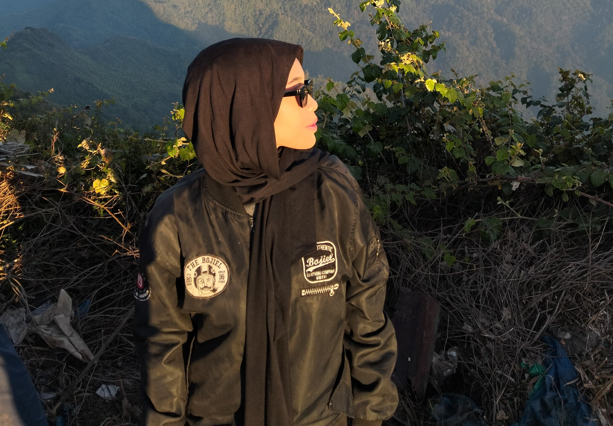

<!DOCTYPE html>
<html lang="en">
  <head>
    <meta charset="UTF-8" />
    <meta name="viewport" content="width=device-width, initial-scale=1.0" />
    <title>Portfolio Sera</title>
    <link rel="stylesheet" href="style2.css" />
    <link
      href="https://unpkg.com/boxicons@2.1.4/css/boxicons.min.css"
      rel="stylesheet"
    />
  </head>
  <body>

    <header class="header">
        
        <a href="home" class="logo">
            Sera Rizkiana
        </a>

        <i class="bx bx-menu" id="menu-icon"></i>

        <nav class="navbar">
            <a href="#home" class="btn-nav">Beranda</a>
            <a href="#about" class="btn-nav">Tentang</a>
            <a href="#education" class="btn-nav">Pendidikan</a>
            <a href="#experience" class="btn-nav">Pengalaman</a>
            <a href="#contact" class="btn-nav">Kontak</a>
        </nav>

        <button class="gradient-btn">Kontak Saya</button>
    </header>
    
    <section class="home" id="home">
        

            <h1>Halo! Selamat Datang pada Sera's Porto</h1>
            <h3>
               Desainer Grafis & Web Development
            </h3>
            
Seorang siswi SMK Jurusan Teknik Komputer dan Jaringan dengan pemahaman baik tentang teknik komputer dan jaringan. Berfokus pada pengembangan skill desain grafis dan pengembangan front end.

            

                <a onclick="window.open('https://wa.link/w8zg4h');">
                    <i class='bx bxl-whatsapp'></i>
                </a>
                
                <a href="mailto:rzknsera@gmail.com" id="email">
                    <i class='bx bxl-gmail'></i>
                </a>

                <a onclick="window.open('https://www.instagram.com/sr.seraa_/');">
                    <i class='bx bxl-instagram-alt'></i>
                </a>
            

            

                <a href="#about" class="btn">Profil</a>
                <a href="#contact" class="btn">Kontak</a>
            

        

        

            
        

    </section>

    <section class="about" id="about">
        

            
        

        

            <h2>Tentang Saya</h2>
            
 Sera Rizkiana, atau akrab disapa sebagai Sera. 
                Lahir di Kota Kudus, pada tanggal 06 Agustus 2007. 
                Saat ini usia saya 17 tahun. Saya berdomisili di Desa Hadipolo RT 05/RW 05 Jekulo Kudus.

            <a href="sera story.jpg" class="btn">Selengkapnya</a>
        

    </section>

    <section class="education" id="education">

        <h2 class="heading">Pendidikan</h2>

        

            

                

                    
2022 - Sekarang

                    

                        <h3>SMK</h3>
                        

                           Menempuh pendidikan pada salah satu sekolah yang terdapat di Kudus, 
                           yakni <a href="https://www.smkn2kudus.sch.id/mainblog/">SMKN 2 Kudus</a>. Tepatnya pada jurusan <a href="https://melupinter.com/">Teknik Jaringan Komputer dan telekomunikasi.</a>
                        

                    
       
            

            

                

                    
2019 - 2022

                    

                        <h3>SMP</h3>
                        

                            Menempuh pendidikan Sekolah Menengah Pertama di <a href="https://smpn1jekulo.sch.id/">SMP 1 Jekulo</a> selama 3 tahun.  Mengikuti Organisasi Tim Inti Pramuka selama 1 tahun sejak 2019-2020
                        

                    

                
            

            

                

                    
2012 - 2018

                    

                        <h3>SD</h3>
                        

                           Menempuh pendidikan dasar selama 6 Tahun di <a href="https://maps.app.goo.gl/NSDcXWKvsDptpuKeA">SD N 3 hadipolo.</a> Dan mengikuti beberapa perlombaan sejak duduk dibangku kelas 3 dasar.
                        

                    

                

            

                <a href="sert.jpg" class="btn-sr">SERTIFIKASI</a>
            
        
    </section>

    <section class="experience" id="experience">
        <h2 class="heading"></h2>
        
        

            

                <h3>Praktik Kerja Lapangan di Java Graphia</h3>
                
Juli-Oktober 2024

                

                    - Sebagai Desainer Grafis percetakan.  
                    - Berpengalaman memeriksa mesin cetak saat terkendala.  
                    - Berpengalaman memperbaiki kesalahan produksi  
                    - Bertanggungjawab penuh atas pekerjaan yang diberikan.  
                

                <iframe src="https://www.google.com/maps/embed?pb=!1m14!1m8!1m3!1d3962.2854885530433!2d110.8736922!3d-6.7349841!3m2!1i1024!2i768!4f13.1!3m3!1m2!1s0x2e70da47b897050d%3A0x8a5bb40215d0d8e5!2sJAVA%20GRAPHIA%20%22Digital%20Printing%20%26%20Stationery!5e0!3m2!1sid!2sid!4v1733803338616!5m2!1sid!2sid" width="300" height="90" style="border:0;" allowfullscreen="" loading="lazy" referrerpolicy="no-referrer-when-downgrade"></iframe>
            

            

                

                <h3>Online Shop - Home Made</h3>
                
2023-2024

                

                    - Berpengelaman menjual beberapa jenis makanan hingga salad buah. 
                    - Menjual tas serut dan mug custom dengan desain yang kreatif.  
                    - Memproduksi secara individu di rumah dan menjual secara online.  
                

                <iframe src="https://www.google.com/maps/embed?pb=!1m18!1m12!1m3!1d7923.48343621425!2d110.88588938555904!3d-6.80124396939999!2m3!1f0!2f0!3f0!3m2!1i1024!2i768!4f13.1!3m3!1m2!1s0x2e70c54fe02916df%3A0xe99da0506296a40f!2sSumber%2C%20Hadipolo%2C%20Kec.%20Jekulo%2C%20Kabupaten%20Kudus%2C%20Jawa%20Tengah!5e0!3m2!1sid!2sid!4v1733806445551!5m2!1sid!2sid" width="300" height="100" style="border:0;" allowfullscreen="" loading="lazy" referrerpolicy="no-referrer-when-downgrade"></iframe>
            

        

    </section>

    <section class="contact" id="contact">
        <h2 class="heading">Hubungi Saya</h2>
        <form action="https://formsubmit.co/rzknsera@gmail.com" method="POST">
            

                

                    <input type="text" placeholder="Nama Lengkap">
                    <input type="email" placeholder="Email">
                

                

                    <input type="number" placeholder="No. HP">
                    <input type="text" placeholder="Subject">
                

            

            

                <textarea name="" id="" placeholder="Pesan" cols="30" rows="10"></textarea>
                <input type="submit" value="Send Message" class="btn">
            

        </form>
    </section>
    

    <footer class="footer">
        

            <a onclick="window.open('https://wa.link/w8zg4h');">
                <i class='bx bxl-whatsapp'></i>
            </a>
            
            <a href="mailto:rzknsera@gmail.com">
                <i class='bx bxl-gmail'></i>
            </a>

            <a onclick="window.open('https://www.instagram.com/sr.seraa_/');">
                <i class='bx bxl-instagram-alt'></i>
            </a>
        

        <ul class="list">
            <li>
                <a href="#">FAQ</a>
            </li>
            <li>
                <a href="about">Tentang Saya</a>
            </li>
            <li>
                <a href="education">Pendidikan</a>
            </li>
            <li>
                <a href="experience">Pengalaman</a>
            </li>
            <li>
                <a href="contact">Kontak Saya</a>
            </li>
        </ul>

        

            Sera Rizkiana | Semua Hak dilindungi Undang-Undang
        

    </footer>

    
  </body>
</html>
